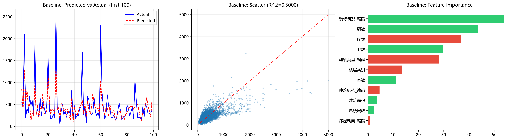
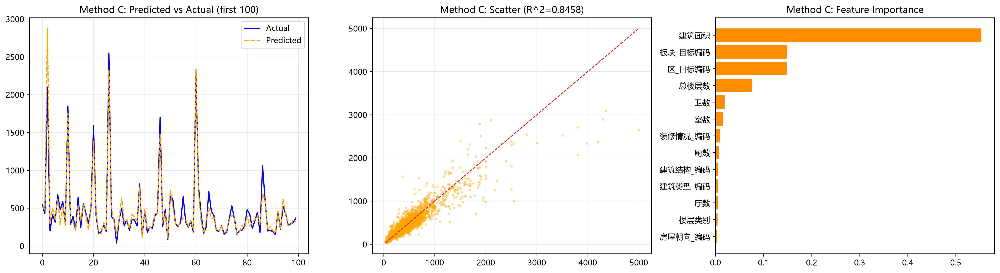

# 杭州二手房价格预测 (Hangzhou Second-hand Housing Price Prediction)

[](https://www.python.org/)
[](https://scikit-learn.org/)
[](LICENSE)

基于 ~25,000 条杭州二手房挂牌数据，对比多种特征编码方式和回归模型，预测房屋总价。最佳模型（GBDT + 区域目标编码）R² 达 **0.8458**，平均预测误差仅 64 万元。

## 项目结构

```
杭州二手房价格分析/
├── data/
│   ├── raw/                        # 原始数据（9个区Excel + 合并文件）
│   └── processed/                  # 预处理后数据（编码后xlsx/csv + 表头）
├── src/
│   ├── merge_data.py               # 数据合并：遍历各区Excel合并为单文件
│   ├── preprocess.py               # 特征编码：户型拆分 + 标签编码
│   ├── train_baseline.py           # 基线模型：线性回归 (11特征)
│   ├── train_method_a.py           # 方法A：LR + 区域位置目标编码
│   ├── train_method_b.py           # 方法B：随机森林 (300棵树, Bagging)
│   └── train_method_c.py           # 方法C：GBDT + 区域TE (最优, Boosting)
├── models/                         # 训练好的模型文件 (.pkl)
├── images/                         # 评估图表 (预测对比 + 特征重要性)
├── docs/                           # 项目文档
│   ├── 方法.md                      # 方法论详解与名词解释
│   ├── 实验报告.md                   # 完整实验数据与对比
│   └── 数据集描述.txt
├── .gitignore
├── requirements.txt
└── README.md
```

## 快速开始

### 环境要求

- Python >= 3.12
- pip

### 安装

```bash
git clone <repo-url>
cd 杭州二手房价格分析
pip install -r requirements.txt
```

### 运行流程

```bash
# 步骤1：合并各区原始数据（可选，data/raw/ 中已有合并文件）
python src/merge_data.py

# 步骤2：数据预处理（特征编码）
python src/preprocess.py

# 步骤3：运行各模型
python src/train_baseline.py        # 基线模型
python src/train_method_a.py        # 方法A
python src/train_method_b.py        # 方法B
python src/train_method_c.py        # 方法C (最优)
```

每个脚本运行后自动：
- 打印 R² / RMSE / MAE 指标
- 输出特征重要性排名
- 保存评估图表到 `images/` 目录

## 实验结果

| 方法 | R² | RMSE | MAE | 模型 | 特征 |
|------|-----|------|-----|------|------|
| 基线 | 0.5000 | 226.98万 | 141.09万 | 线性回归 | 11 |
| 方法A | 0.6432 | 191.72万 | 114.44万 | LR + 区域TE | 13 |
| 方法B | 0.6368 | 193.46万 | 111.47万 | 随机森林(300树) | 11 |
| **方法C** | **0.8458** | **126.05万** | **64.28万** | **GBDT + 区域TE** | 13 |

### 方法对比图

| 基线 | 方法C (最优) |
|------|-------------|
|  |  |

详细分析见 [`docs/实验报告.md`](docs/实验报告.md) 和 [`docs/方法.md`](docs/方法.md)。

## 核心方法论

### 1. 特征编码演进

| 方案 | 做法 | 特征数 | 效果 |
|------|------|--------|------|
| 独热编码 | 户型拆为200+列二值变量 | 230+ | R² 极低 |
| 标签编码 + 户型拆分 | 户型→室数/厅数/厨数/卫数, 其余标签编码 | 11 | R²=0.50 |
| + 区域目标编码 | 区域位置用K折均值编码替代标签编码 | 13 | R²=0.64 |

### 2. 模型选型

- **线性回归**：可解释性强，每个系数有明确业务含义，但只能学习线性关系
- **随机森林 (Bagging)**：300棵树并行训练取平均，靠多样性降低误差
- **GBDT (Boosting)**：逐棵修正残差，捕获非线性关系和特征交互，最终 R²=0.85

### 3. 关键技术细节

- **多重共线性**：VIF 最高达 24.9（室数/厨数/面积），但 Ridge/Lasso 无效——联合信息不可替代
- **目标编码**：5折交叉防数据泄漏，区域房价均值作为编码值
- **过拟合控制**：GBDT 用 learning_rate=0.1 + subsample=0.8 + max_depth=5 控制

## 许可证

MIT License
